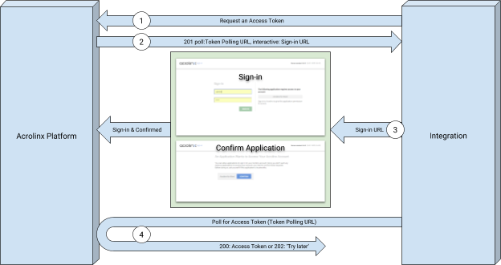
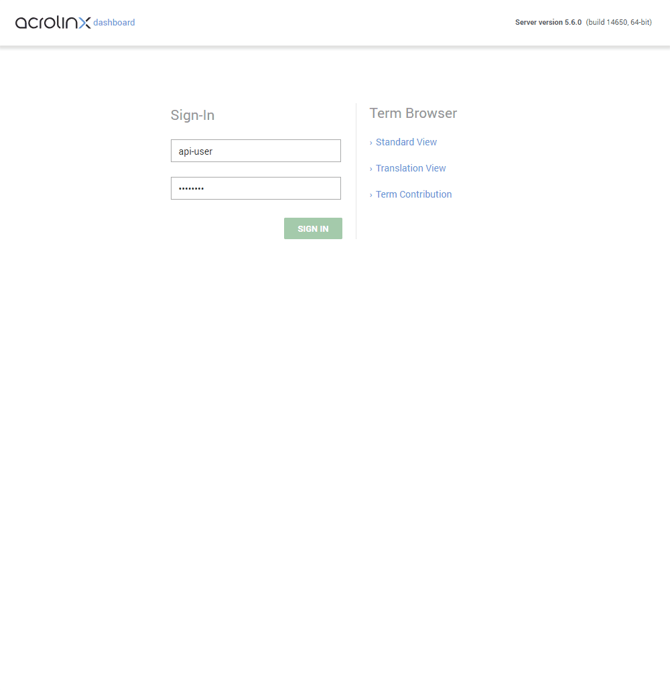

# Acrolinx Platform API

Hello and welcome to the Acrolinx Platform API.
This documentation is for you if you plan to use:

* the API directly,
* implement your own integration,
* or just want to know how the interaction between the Acrolinx Platform and its integrations works.

In the [reference](#reference), you can find the documentation for all services and methods.

## Prerequisites

Please contact [Acrolinx SDK support](https://github.com/acrolinx/acrolinx-coding-guidance/blob/master/topics/sdk-support.md)
for consulting and getting your integration certified.
This sample works with a test license on an internal Acrolinx URL.
This license is only meant for demonstration and developing purposes.
Once you finished your integration, you'll have to get a license for your integration from Acrolinx.
  
Acrolinx offers different other SDKs, and examples for developing integrations.

Before you start developing your own integration, you might benefit from looking into:

* [Getting Started with Custom Integrations](https://support.acrolinx.com/hc/en-us/articles/205687652-Getting-Started-with-Custom-Integrations),
* the [Guidance for the Development of Acrolinx Integrations](https://github.com/acrolinx/acrolinx-coding-guidance),
* the [Acrolinx SDKs](https://github.com/acrolinx?q=sdk), and
* the [Acrolinx Demo Projects](https://github.com/acrolinx?q=demo).

## Getting Started

You'll need the following:

* A URL of an Acrolinx Platform instance
* A user on that Acrolinx Platform instance
* A signature (more on that later)
* Any means to make http calls
* Any means of reading and writing JSON strings

Make yourself familiar with the concepts of [authentication](https://github.com/acrolinx/acrolinx-coding-guidance/blob/master/topics/configuration.md),
[signature](https://github.com/acrolinx/acrolinx-coding-guidance/blob/master/topics/packaging.md#packaging),
and [document](https://github.com/acrolinx/acrolinx-coding-guidance/blob/master/topics/text-extraction.md).
If you can't wait, you can also jump to the [Quick Start Tutorial](quickstart.md) and start tinkering around.

## Important Headers and Content Type

Make sure that you always include the following headers:

```HTTP
X-Acrolinx-Auth: YOUR_ACCESS_TOKEN
X-Acrolinx-Client: YOUR_SIGNATURE
Content-Type:application/json
```

More on the contents of these headers in the individual topics.
In general make sure that all requests to the Acrolinx Platform API are containing these headers.
Use Cases
Make sure that you actually need to use the API directly. We have SDKs and ready made integrations.
More information you can find here.

## Authentication

To make use of the API, you'll need to have an access token.
The access token needs to be sent for every request done to the API with the header parameter `X-Acrolinx-Auth`.

```HTTP
X-Acrolinx-Auth:SOME_ACCESS_TOKEN_STRING
```

Access tokens are bound to a user and there are two different variants:

* default access tokens that you're getting by signing in to Acrolinx, or
* API Tokens.

Access Tokens normally only have a total lifetime of 30 days. After that they have to be renewed.

API Tokens live much longer: 4 years.

## Getting an Access Token with Acrolinx Sign-In

The Acrolinx sign-in process is targeted at situations where you want individual users to sign in.
Authentication is handled by a web application of the Acrolinx Platform.

This is how it works:



1. Integration requests an access token:

    ```HTTP
    POST: https://tenant.acrolinx.cloud/api/v1/auth/sign-ins
    ```

2. The Platform will return two URLs: an `interactive`, and a `poll` URL in a result like this:

    ```HTTP
    {
        "data": {
            "state": "Started",
            "interactiveLinkTimeout": 900
        },
        "links": {
            "interactive": "https://tenant.acrolinx.cloud/dashboard.html?login=19901-2-8412998412",
            "poll": "https://tenant.acrolinx.cloud/api/v1/auth/sign-ins/185-0ijfgklejt2390tui"
        }
    }
    ```

3. Promt the `interactive` URL to the user to authenticate.
    Poll with the `poll` URL until you're getting an http response (code 200).

    ```HTTP
    {
        "data": {
            "state": "Success",
            "accessToken": "123579080a8d1fee12490a90dc3",
            "authorizedUsing": "ACROLINX_SIGN_IN",
            "privileges": [
            "CheckingAndClients.checkingApplications",
            "CheckingAndClients.submitDictionaryEntry"
            ],
            "userId": "fred"
        },
        "links": {
            "user": "https://tenant.acrolinx.cloud/api/v1/user/fred"
        }
    }
    ```

## Getting an API Token

Getting an API Token is easy:

* Sing-in to the Acrolinx Dashboard
* Click on ‘Settings' on the top
* Scroll down
* Click on ‘CREATE API TOKEN'
* Copy the API token. You can revisit this site later to get your token again.



## Signature

The signature is a string that identifies your integration.
For developing purposes you should use the following:

```TEXT
SW50ZWdyYXRpb25EZXZlbG9wbWVudERlbW9Pbmx5
```

Once you've certified your integration, you'll get your own signature.

It should be included in every request you're doing to the Acrolinx Platform API as a header:

```HTTP
X-Acrolinx-Client: YOUR_SIGNATURE; VERSION_NUMBER; BUILD_NUMBER
```

The API won't complain if you don't send a
[version and build number](https://github.com/acrolinx/acrolinx-coding-guidance/blob/master/topics/project-setup.md#version-information).
For getting [certified](https://github.com/acrolinx/acrolinx-coding-guidance/blob/master/topics/checklist.md),
you must send this information.
Maintenance in production is getting much easier with a version and build number.

## FAQ / Questions and Answers

* What about Authentication? SSO?
    + Authentication is done either via an API Token or via Acrolinx sign-in.
      Acrolinx sign-in supports different SSO methods using PingFederate.
* Can you get the dashboard or the content report as JSON as well?
    + The analytics results aren’t available as JSON.
* How does the API relate to the products named Java Automation SDK, JavaScript Automation SDK etc.
   that are in the Integration Release Schedule?
    + SDKs build on the API and would give you a basic framework using the API in a language like Java or JavaScript.
      However with the new API, we think that there’s no need for an SDK in most use cases.
      Once we’ve released the Acrolinx Platform API, we'll decide based on feedback if and which SDKs we’re providing.
* Can we put hierarchies in the document reference, for example: `<book>`, `<chapter>`, `<section>`
  so the analytics would group all check results for the book, chapter and so on?
    + If you want to group content, you should use document custom fields.
      These will also be available via the API.
      The document reference is important for identifying a piece of content but it isn’t used to group content.
* Can we add a link to each checked item in the batch, so the Content Analysis Dashboard can provide a link back
  to the content in the overview?
    + In most cases your document reference, actually is the link to your content.
      If you need to provide a separate or different link, you may use custom fields for this.

## Reference

### [Rendered Version on apiary.io](http://docs.acrolinxapi.apiary.io/#)

### [Plain Version](apiary.apib)

## License

Copyright 2018-present Acrolinx GmbH

Licensed under the Apache License, Version 2.0 (the "License");
you may not use this file except in compliance with the License.
You may obtain a copy of the License at:

[http://www.apache.org/licenses/LICENSE-2.0](http://www.apache.org/licenses/LICENSE-2.0)

Unless required by applicable law or agreed to in writing, software
distributed under the License is distributed on an "AS IS" BASIS,
WITHOUT WARRANTIES OR CONDITIONS OF ANY KIND, either express or implied.
See the License for the specific language governing permissions and
limitations under the License.

For more information visit: [https://www.acrolinx.com](https://www.acrolinx.com)
