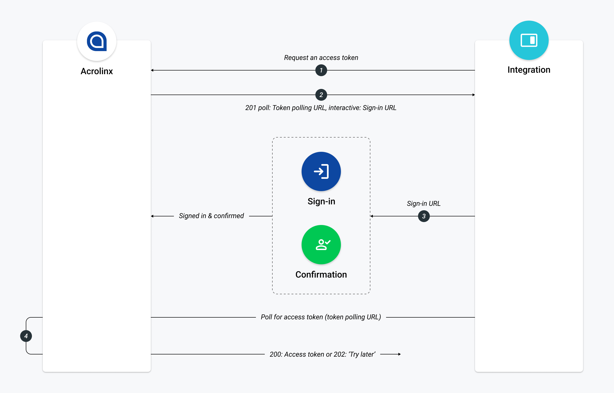

# Acrolinx API


Welcome to the Acrolinx API!
This documentation helps you:

* use the API directly
* build your own integration
* understand how Acrolinx interacts with integrations

The [API reference](https://acrolinxapi.docs.apiary.io) describes all
services and methods.

## Get started

Contact [Acrolinx support](https://github.com/acrolinx/acrolinx-coding-guidance/blob/master/topics/support.md)
for consulting and getting your integration certified.

Acrolinx provides different SDKs and samples for building integrations.

Before you start building your own integration, you might want to read
the following:

* [Getting started with custom integrations](https://docs.acrolinx.com/customintegrations)
* [How to integrate with Acrolinx](https://github.com/acrolinx/acrolinx-coding-guidance)
* [Acrolinx SDKs](https://github.com/acrolinx?q=sdk)
* [Acrolinx demo projects](https://github.com/acrolinx?q=demo).

## Prerequisites

You'll need the following:

* An Acrolinx URL
* A user on that Acrolinx instance
* A signature

Understand the following concepts:
* [authentication](https://github.com/acrolinx/acrolinx-coding-guidance/blob/main/topics/authentication.md)
* [signatures](#signature)
* [document](https://github.com/acrolinx/acrolinx-coding-guidance/blob/main/topics/text-extraction.md#whats-a-document).

## Authentication

To use the Authentication API, you'll need an access token. Send the
access token with the header parameter `X-Acrolinx-Auth` for every API
request.

```HTTP
X-Acrolinx-Auth:SOME_ACCESS_TOKEN_STRING
```

Access tokens are associated with a user and come in two forms:

1. Access tokens that you get by signing in to Acrolinx

   Access tokens normally have a lifetime of 30 days. After that, you
   have to renew them.
2. API tokens

   API tokens have a lifespan of 4 years.

## Acrolinx sign-in process

The Acrolinx sign-in process is for individual users to sign in.
An Acrolinx web application handles the authentication.

This is how it works:



1. Integration requests an access token:

    ```HTTP
    POST: https://tenant.acrolinx.cloud/api/v1/auth/sign-ins
    ```

2. Acrolinx returns two URLs: an `interactive` and a `poll` URL in a
   result like this:

    ```HTTP
    {
        "data": {
            "state": "Started",
            "interactiveLinkTimeout": 900
        },
        "links": {
            "interactive": "https://tenant.acrolinx.cloud/dashboard.html?login=19901-2-8412998412",
            "poll": "https://tenant.acrolinx.cloud/api/v1/auth/sign-ins/185-0ijfgklejt2390tui"
        }
    }
    ```

3. Prompt the `interactive` URL for the user to authenticate.
    Poll with the `poll` URL until you get an http response (code 200).

    ```HTTP
    {
        "data": {
            "state": "Success",
            "accessToken": "123579080a8d1fee12490a90dc3",
            "authorizedUsing": "ACROLINX_SIGN_IN",
            "privileges": [
            "CheckingAndClients.checkingApplications",
            "CheckingAndClients.submitDictionaryEntry"
            ],
            "userId": "fred"
        },
        "links": {
            "user": "https://tenant.acrolinx.cloud/api/v1/user/fred"
        }
    }
    ```

## Create an API token

Creating an API token is easy:

1. Sign in to Acrolinx.
2. Go to your ‘Settings'.
3. Click CREATE API TOKEN.
4. Copy the API token.

**Note** After you generate an API token, save it somewhere secure
(like a password manager) so that you can access it again. Once you
leave the Settings page, the API token will no longer appear on
screen.

## Signature

A signature is a string that identifies an integration.

Include the signature as a header in every request you send to the
Acrolinx API:

```HTTP
X-Acrolinx-Client: YOUR_SIGNATURE; VERSION_NUMBER
```

The `VERSION_NUMBER` should follow the following pattern `X.X.X.X` like `1.0.0.1`.

To get
[certified](https://github.com/acrolinx/acrolinx-coding-guidance/blob/master/topics/checklist.md),
your integration needs to send the [version and build
number](https://github.com/acrolinx/acrolinx-coding-guidance/blob/master/topics/project-setup.md#version-information).

Maintaining your integration in production is much easier with a
version and build number.

## API reference

### [Rendered version on apiary.io](https://acrolinxapi.docs.apiary.io/#)

### [Plain version](apiary.apib)

## License

Copyright 2018-present Acrolinx GmbH

Licensed under the Apache License, Version 2.0 (the "License");
you may not use this file except in compliance with the License.
You may obtain a copy of the License at:

[http://www.apache.org/licenses/LICENSE-2.0](http://www.apache.org/licenses/LICENSE-2.0)

Unless required by applicable law or agreed to in writing, software
distributed under the License is distributed on an "AS IS" BASIS,
WITHOUT WARRANTIES OR CONDITIONS OF ANY KIND, either express or implied.
See the License for the specific language governing permissions and
limitations under the License.

For more information visit: [https://www.acrolinx.com](https://www.acrolinx.com)
